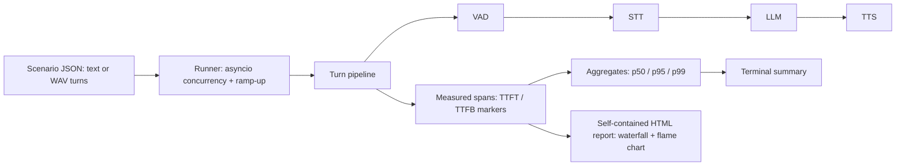

# voiceprobe

[English](README.md) | [中文](README.zh.md) | [日本語](README.ja.md)

[](LICENSE) 

**セルフホストできるオープンソースの voice agent 負荷テスト・段階別レイテンシ分析ツール（VAD / STT / LLM / TTS）。**


```bash
git clone https://github.com/JaydenCJ/voiceprobe.git && cd voiceprobe && pip install -e .
```

## なぜ voiceprobe なのか

voice agent の成否は応答レイテンシで決まります。応答に 1〜2 秒以上かかると、発話者はボットに被せて話し始めるか、電話を切ってしまいます。ところがパイプラインが遅いとき、多くのチームに見えるのはエンドツーエンドの合計値 1 つだけです。VAD・STT・LLM・TTS のどこが時間を食っているのか、1 コールが 10 コール・50 コールの同時接続になると何が起きるのかは分かりません。この問いに答えられる既存ツール（Coval、Hamming、Cekura）はいずれも商用 SaaS であり、通話音声を自社インフラの外に出せないコールセンター・金融・医療の現場では採用できません。

|  | voiceprobe | Coval | Hamming |
|---|---|---|---|
| ライセンス | MIT (open source) | Closed source (SaaS) | Closed source (SaaS) |
| デプロイ形態 | Self-hosted, runs offline | Cloud service | Cloud service |
| 通話音声が自社インフラ外に出るか | No | Yes | Yes |
| 価格 | Free | Commercial (raised $28M Series A) | Commercial |
| ランタイムのサードパーティ依存 | 0 (Python stdlib only) | n/a (SaaS) | n/a (SaaS) |

## 特徴

- **並行性を前提に設計** — asyncio 上で N コールを同時にシミュレートし、線形 ramp-up とコール単位のタイムアウトに対応します。単発デモではなく、負荷時の p95 を確認できます。
- **ミリ秒単位の帰属** — 各ターンを VAD → STT → LLM → TTS のスパンとして計測し、TTFT/TTFB マーカーに加えて、発話者が体感する first-token / first-audio レイテンシを算出します。
- **持ち運べるレポート** — 自己完結型の HTML ファイル 1 枚（インライン SVG、JavaScript ゼロ、外部アセットゼロ）に、コール別ウォーターフォール、全体のフレームチャート、first-audio ヒストグラム、p50/p95/p99 の統計表をまとめます。
- **ランタイム依存ゼロ** — Python 標準ライブラリのみで動作します。数秒でインストールでき、監査や運用の対象が増えません。
- **自分の音声を使える** — シナリオの各ターンには、実際の WAV 録音（`audio_file`）か、テキストから決定的に合成した音声様波形を指定できます。
- **自分のスタックを接続** — 4 段すべてが Python Protocol です。OpenAI 互換の HTTP アダプタ（multipart STT、SSE streaming LLM、streaming TTS）を同梱し、モデルの重みは同梱もダウンロードもしません。
- **決定的で再現可能** — seed 付きの mock スタックは同じ seed で同じ数値を返します。帰属の計算は、テストスイート内で仮想クロックにより厳密に検証済みです。

## クイックスタート

インストール:

```bash
git clone https://github.com/JaydenCJ/voiceprobe.git && cd voiceprobe && pip install -e .
```

シナリオを生成し、10 コール同時の負荷テストを実行します:

```bash
voiceprobe init
voiceprobe run --scenario scenario.json --calls 10 --ramp 2 --seed 42 --out results.json --html report.html
```

出力:

```text
voiceprobe 0.1.0 — scenario 'billing-support', 10 call(s), backend mock
results written to results.json
HTML report written to report.html
calls: 10  ok: 10  failed: 0  turns: 30  wall time: 11.95s

stage        count  mean ms   p50 ms   p95 ms   p99 ms   max ms  share
----------------------------------------------------------------------
vad             30       58       60       67       67       67  # 2%
stt             30      425      382      520      520      520  #### 15%
llm             30     1012     1025     1114     1128     1128  ######### 36%
tts             30     1317     1314     1404     1406     1406  ########### 47%
----------------------------------------------------------------------
first token (e2e)  mean    923 ms   p50    913 ms   p95   1041 ms   max   1041 ms
first audio (e2e)  mean   1652 ms   p50   1631 ms   p95   1855 ms   max   1868 ms
turn total         mean   2855 ms   p50   2869 ms   p95   3041 ms   max   3079 ms
```

その後、ブラウザで `report.html` を開くと、コール別ウォーターフォールと全体のフレームチャートを確認できます。

上記の数値は内蔵の決定的 mock スタックによるものです。`fast` / `typical` / `slow` のレイテンシプロファイルはハーネスを動かすためのシミュレーションパラメータであり、実在サービスのベンチマークではありません。voiceprobe はモデルを同梱せず、重みのダウンロードも行いません。実際のスタックを分析するには、HTTP アダプタを任意の OpenAI 互換エンドポイントに向けます（[`docs/backends.example.json`](docs/backends.example.json) を参照）。API key は `api_key_env` による環境変数名の参照のみを受け付け、設定ファイル内のインラインシークレットは拒否されます。ローカルで API key 不要の構成（Ollama / whisper.cpp / Kokoro）とアダプタの正確なリクエスト/レスポンス契約は [`docs/real-endpoints.md`](docs/real-endpoints.md) を参照してください。次のコマンドの実行には、到達可能なエンドポイントと、参照される環境変数（例: `OPENAI_API_KEY`）の設定が必要です:

```bash
voiceprobe run --scenario scenario.json --calls 10 --backend http --backend-config docs/backends.example.json --out results.json --html report.html
```

## アーキテクチャ



## ロードマップ

- [x] 同時コールシミュレーション、VAD/STT/LLM/TTS の段階別厳密帰属、自己完結型ウォーターフォール / フレームチャート HTML レポート（v0.1.0）
- [ ] 文単位の TTS オーバーラップ: LLM の出力を文ごとに TTS へストリーミングし、重畳後のパイプラインを計測
- [ ] Pipecat と LiveKit パイプライン向けのネイティブプローブ
- [ ] streaming の部分認識結果に対する STT レイテンシ計測
- [ ] CI レイテンシバジェット: p95 first-audio レイテンシが設定した閾値を超えたら実行を失敗させる

全体は [open issues](https://github.com/JaydenCJ/voiceprobe/issues) を参照してください。

## コントリビューション

コントリビューションを歓迎します。変更したい内容を [issue](https://github.com/JaydenCJ/voiceprobe/issues) でお気軽にご相談ください。開発環境の構築は [CONTRIBUTING.md](CONTRIBUTING.md) を参照してください。

## ライセンス

[MIT](LICENSE)
