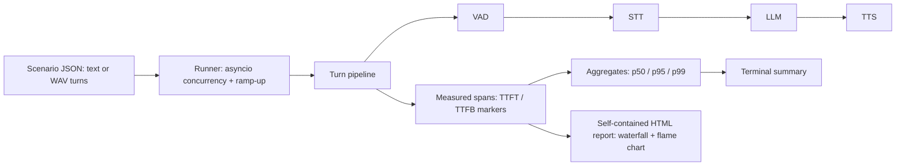

# voiceprobe

[English](README.md) | [中文](README.zh.md) | [日本語](README.ja.md)

[](LICENSE) 

**Self-hosted, open-source load testing and per-stage latency profiling for voice agents (VAD / STT / LLM / TTS).**


```bash
git clone https://github.com/JaydenCJ/voiceprobe.git && cd voiceprobe && pip install -e .
```

## Why voiceprobe?

Voice agents live or die by response latency: once the bot takes more than a second or two to answer, callers talk over it or hang up. Yet when a pipeline is slow, most teams only see one end-to-end number — not whether VAD, STT, the LLM or TTS is eating the budget, and not what happens under 10 or 50 concurrent calls instead of one. The tools that do answer those questions today (Coval, Hamming, Cekura) are commercial SaaS, which rules them out for call-center, finance and healthcare workloads where call audio cannot leave your infrastructure.

|  | voiceprobe | Coval | Hamming |
|---|---|---|---|
| License | MIT (open source) | Closed source (SaaS) | Closed source (SaaS) |
| Deployment | Self-hosted, runs offline | Cloud service | Cloud service |
| Call audio leaves your infrastructure | No | Yes | Yes |
| Price | Free | Commercial (raised $28M Series A) | Commercial |
| Runtime third-party dependencies | 0 (Python stdlib only) | n/a (SaaS) | n/a (SaaS) |

## Features

- **Concurrent by construction** — simulates N calls on asyncio with linear ramp-up and per-call timeouts, so you see p95 under load instead of a single-call demo.
- **Millisecond attribution** — every turn is measured as VAD → STT → LLM → TTS spans with TTFT/TTFB markers, plus caller-perceived first-token and first-audio latency.
- **Reports that travel** — one self-contained HTML file (inline SVG, zero JavaScript, zero external assets) with per-call waterfalls, a whole-run flame chart, a first-audio histogram and p50/p95/p99 tables.
- **Zero runtime dependencies** — pure Python standard library; installs in seconds, nothing extra to audit or operate.
- **Your own audio** — scenario turns take your real WAV recordings (`audio_file`) or deterministic speech-shaped audio synthesized from text.
- **Bring your own stack** — all four stages are Python Protocols; OpenAI-compatible HTTP adapters (multipart STT, SSE-streaming LLM, streamed TTS) are included, and no model weights are shipped or downloaded.
- **Deterministic runs** — the seeded mock stack returns identical numbers for identical seeds, and the attribution math is asserted exactly under a virtual clock in the test suite.

## Quickstart

Install:

```bash
git clone https://github.com/JaydenCJ/voiceprobe.git && cd voiceprobe && pip install -e .
```

Scaffold a scenario and run a 10-call load test:

```bash
voiceprobe init
voiceprobe run --scenario scenario.json --calls 10 --ramp 2 --seed 42 --out results.json --html report.html
```

Output:

```text
voiceprobe 0.1.0 — scenario 'billing-support', 10 call(s), backend mock
results written to results.json
HTML report written to report.html
calls: 10  ok: 10  failed: 0  turns: 30  wall time: 11.95s

stage        count  mean ms   p50 ms   p95 ms   p99 ms   max ms  share
----------------------------------------------------------------------
vad             30       58       60       67       67       67  # 2%
stt             30      425      382      520      520      520  #### 15%
llm             30     1012     1025     1114     1128     1128  ######### 36%
tts             30     1317     1314     1404     1406     1406  ########### 47%
----------------------------------------------------------------------
first token (e2e)  mean    923 ms   p50    913 ms   p95   1041 ms   max   1041 ms
first audio (e2e)  mean   1652 ms   p50   1631 ms   p95   1855 ms   max   1868 ms
turn total         mean   2855 ms   p50   2869 ms   p95   3041 ms   max   3079 ms
```

Then open `report.html` in a browser for the per-call waterfalls and the whole-run flame chart.

The numbers above come from the built-in deterministic mock stack — its `fast` / `typical` / `slow` latency profiles are simulated parameters for exercising the harness, not a benchmark of any real service. voiceprobe ships no models and never downloads weights; to profile your real stack, point the HTTP adapters at any OpenAI-compatible endpoints (see [`docs/backends.example.json`](docs/backends.example.json)). API keys are referenced via `api_key_env` environment-variable names only — inline secrets in the config file are rejected. For fully local, keyless setups (Ollama / whisper.cpp / Kokoro) and the exact adapter wire contract, see [`docs/real-endpoints.md`](docs/real-endpoints.md). The command below requires reachable endpoints and the referenced environment variable (e.g. `OPENAI_API_KEY`) to be set:

```bash
voiceprobe run --scenario scenario.json --calls 10 --backend http --backend-config docs/backends.example.json --out results.json --html report.html
```

## Architecture



## Roadmap

- [x] Concurrent call simulation, exact per-stage VAD/STT/LLM/TTS attribution, self-contained waterfall / flame-chart HTML reports (v0.1.0)
- [ ] Sentence-level TTS overlap: stream LLM output into TTS sentence by sentence and measure the overlapped pipeline
- [ ] Native probes for Pipecat and LiveKit pipelines
- [ ] Streaming partial-result STT latency measurement
- [ ] CI latency budgets: fail the run when p95 first-audio latency exceeds a configured threshold

See the [open issues](https://github.com/JaydenCJ/voiceprobe/issues) for the full list.

## Contributing

Contributions are welcome — open an [issue](https://github.com/JaydenCJ/voiceprobe/issues) to discuss what you would like to change. See [CONTRIBUTING.md](CONTRIBUTING.md) for the development setup.

## License

[MIT](LICENSE)
