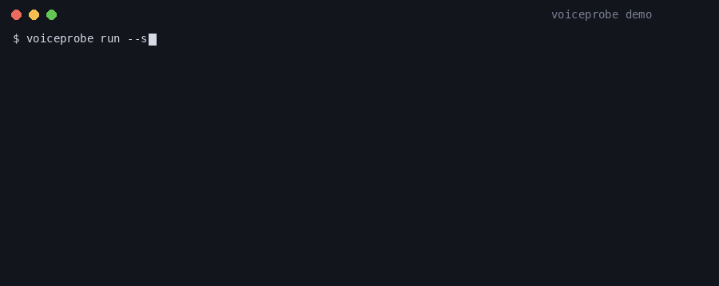
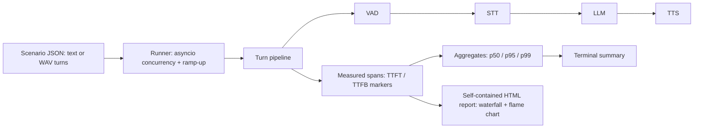

# voiceprobe

[English](README.md) | [中文](README.zh.md) | [日本語](README.ja.md)

[](LICENSE) 

**自托管的开源语音 agent 负载测试与分段延迟剖析工具（VAD / STT / LLM / TTS）。**



```bash
git clone https://github.com/JaydenCJ/voiceprobe.git && cd voiceprobe && pip install -e .
```

## 为什么是 voiceprobe？

语音 agent 的生死线是响应延迟：机器人超过一两秒不开口，来电者就会抢话或直接挂断。可当管线变慢时，多数团队只能看到一个端到端总数——既不知道是 VAD、STT、LLM 还是 TTS 在吃掉预算，也不知道从 1 路变成 10 路、50 路并发后会发生什么。目前能回答这些问题的工具（Coval、Hamming、Cekura）全是商业 SaaS，对呼叫中心、金融、医疗这类通话录音不能离开自有基础设施的场景直接出局。

|  | voiceprobe | Coval | Hamming |
|---|---|---|---|
| 许可证 | MIT (open source) | Closed source (SaaS) | Closed source (SaaS) |
| 部署方式 | Self-hosted, runs offline | Cloud service | Cloud service |
| 通话音频是否离开自有基础设施 | No | Yes | Yes |
| 价格 | Free | Commercial (raised $28M Series A) | Commercial |
| 运行时第三方依赖 | 0 (Python stdlib only) | n/a (SaaS) | n/a (SaaS) |

## 特性

- **并发是原生能力** —— 基于 asyncio 模拟 N 路通话，支持线性 ramp-up 与单通话超时，看到的是负载下的 p95，而不是单路 demo。
- **毫秒级归因** —— 每个对话轮次按 VAD → STT → LLM → TTS 逐段测量 Span，带 TTFT/TTFB 标记，并派生来电者体感的首 token / 首音频延迟。
- **报告随处可带** —— 单个自包含 HTML 文件（内联 SVG、零 JavaScript、零外部资源）：逐通话瀑布图、整场火焰图、首音频直方图与 p50/p95/p99 统计表。
- **零运行时依赖** —— 纯 Python 标准库；秒级安装，没有任何额外组件需要审计或运维。
- **用你自己的音频** —— 场景轮次既可用你的真实 WAV 录音（`audio_file`），也可由文本确定性合成语音形波形。
- **接入你自己的栈** —— 四个阶段全部是 Python Protocol；内置 OpenAI 兼容 HTTP 适配器（multipart STT、SSE 流式 LLM、流式 TTS），不携带也不下载任何模型权重。
- **确定性可复现** —— 带种子的 mock 栈同一 seed 输出完全相同的数字；归因数学在测试套件中用虚拟时钟做精确断言。

## 快速开始

安装：

```bash
git clone https://github.com/JaydenCJ/voiceprobe.git && cd voiceprobe && pip install -e .
```

生成场景并跑一次 10 路并发负载测试：

```bash
voiceprobe init
voiceprobe run --scenario scenario.json --calls 10 --ramp 2 --seed 42 --out results.json --html report.html
```

输出：

```text
voiceprobe 0.1.0 — scenario 'billing-support', 10 call(s), backend mock
results written to results.json
HTML report written to report.html
calls: 10  ok: 10  failed: 0  turns: 30  wall time: 11.95s

stage        count  mean ms   p50 ms   p95 ms   p99 ms   max ms  share
----------------------------------------------------------------------
vad             30       58       60       67       67       67  # 2%
stt             30      425      382      520      520      520  #### 15%
llm             30     1012     1025     1114     1128     1128  ######### 36%
tts             30     1317     1314     1404     1406     1406  ########### 47%
----------------------------------------------------------------------
first token (e2e)  mean    923 ms   p50    913 ms   p95   1041 ms   max   1041 ms
first audio (e2e)  mean   1652 ms   p50   1631 ms   p95   1855 ms   max   1868 ms
turn total         mean   2855 ms   p50   2869 ms   p95   3041 ms   max   3079 ms
```

然后在浏览器打开 `report.html`，即可查看逐通话瀑布图与整场火焰图。

上面的数字来自内置的确定性 mock 栈——其 `fast` / `typical` / `slow` 延迟 profile 是用于演练测试框架的模拟参数，不是对任何真实服务的 benchmark。voiceprobe 不携带模型、也从不下载权重；要剖析你的真实栈，把 HTTP 适配器指向任意 OpenAI 兼容端点即可（参见 [`docs/backends.example.json`](docs/backends.example.json)）。API key 只能通过 `api_key_env` 引用环境变量名——配置文件中出现内联密钥会被直接拒绝。本地免密钥组合（Ollama / whisper.cpp / Kokoro）与适配器的精确请求/响应契约见 [`docs/real-endpoints.md`](docs/real-endpoints.md)。下面这条命令需要可达的端点，并已设置所引用的环境变量（如 `OPENAI_API_KEY`）：

```bash
voiceprobe run --scenario scenario.json --calls 10 --backend http --backend-config docs/backends.example.json --out results.json --html report.html
```

## 架构



## 路线图

- [x] 并发通话模拟、逐段 VAD/STT/LLM/TTS 精确归因、自包含瀑布图 / 火焰图 HTML 报告（v0.1.0）
- [ ] 句级 TTS 重叠：LLM 输出按句流式送入 TTS，并测量重叠后的管线
- [ ] Pipecat 与 LiveKit 管线的原生探针
- [ ] 流式 partial 结果的 STT 延迟测量
- [ ] CI 延迟预算：p95 首音频延迟超过配置阈值时让运行失败

完整列表见 [open issues](https://github.com/JaydenCJ/voiceprobe/issues)。

## 参与贡献

欢迎贡献——开一个 [issue](https://github.com/JaydenCJ/voiceprobe/issues) 讨论你想改的内容。开发环境搭建见 [CONTRIBUTING.md](CONTRIBUTING.md)。

## 许可证

[MIT](LICENSE)
